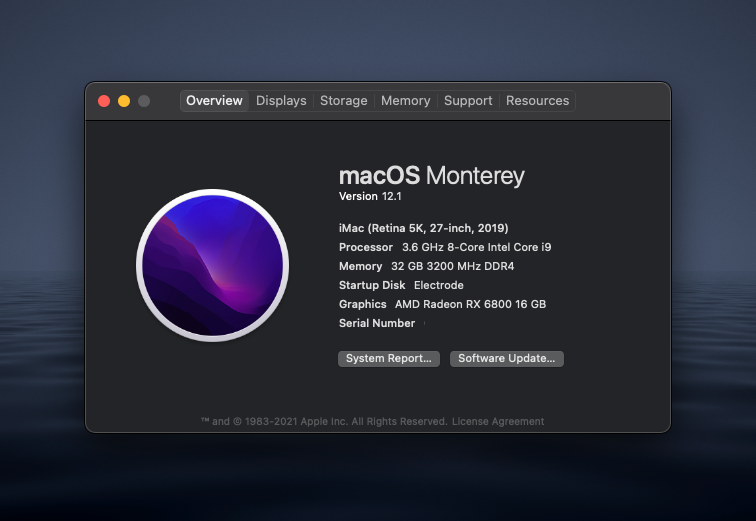
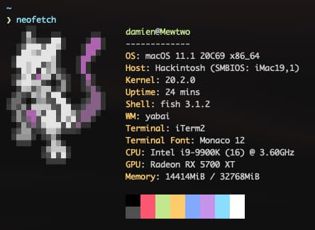

# Table of Contents

- [Table of Contents](#table-of-contents)
- [Changelog](#changelog)
- [Hackintosh](#hackintosh)
  - [Hardware configuration](#hardware-configuration)
  - [What works](#what-works)
  - [What doesn't work / didn't test](#what-doesnt-work--didnt-test)
  - [Configuration quirks](#configuration-quirks)
    - [BIOS settings](#bios-settings)
    - [DRMs](#drms)
    - [IGPU / Sidecar](#igpu--sidecar)
    - [Energy Saver](#energy-saver)
  - [System Information](#system-information)
  - [Benchmarks](#benchmarks)
  - [USB Ports](#usb-ports)

# Changelog

- 2021/05/23: Updated to OpenCore 0.6.8 and macOS 11.3.1
- 2021/04/11: Updated to OpenCore 0.6.8 and macOS 11.2.3
- 2021/02/02: Updated to OpenCore 0.6.6 and macOS 11.2
  - [Update instructions](./docs/update-oc-066.md)
- 2021/01/29: Updated to OpenCore 0.6.5
- 2020/12/16: Updated to OpenCore 0.6.4 for macOS 11.1

# Hackintosh

This is a git repo of my [OpenCore](https://github.com/acidanthera/OpenCorePkg) EFI folder.
Everything was made by following the (excellent) [OpenCore Vanilla Guide](https://khronokernel.github.io/Opencore-Vanilla-Desktop-Guide/).

Shout out to MykolaG on the r/Hackintosh Discord for their help with [Windows booting](https://github.com/eramdam/hackintosh/commit/d15d29f647c305db44c1188222cbd3f53f172deb).

Feel free to re-use this configuration if you have the same CPU + motherboard combo and an AMD GPU.

## Hardware configuration

[PCPartPicker Part List](https://pcpartpicker.com/list/JbnZy4)

<details>
  <a href="https://pcpartpicker.com/list/JbnZy4">PCPartPicker Part List</a>
  <table class="pcpp-part-list">
    <thead>
      <tr>
        <th>Type</th>
        <th>Item</th>
      </tr>
    </thead>
    <tbody>
      <tr>
        <td class="pcpp-part-list-type">CPU</td>
        <td class="pcpp-part-list-item"><a href="https://pcpartpicker.com/product/jHZFf7/intel-core-i9-9900k-36ghz-8-core-processor-bx80684i99900k">Intel Core i9-9900K 3.6 GHz 8-Core Processor</a></td>
      </tr>
      <tr>
        <td class="pcpp-part-list-type">CPU Cooler</td>
        <td class="pcpp-part-list-item"><a href="https://pcpartpicker.com/product/PVfFf7/nzxt-kraken-x53-7311-cfm-liquid-cpu-cooler-rl-krx53-01">NZXT Kraken X53 73.11 CFM Liquid CPU Cooler</a></td>
      </tr>
      <tr>
        <td class="pcpp-part-list-type">Motherboard</td>
        <td class="pcpp-part-list-item"><a href="https://pcpartpicker.com/product/Tmprxr/asus-rog-strix-z390-i-gaming-mini-itx-lga1151-motherboard-rog-strix-z390-i-gaming">Asus ROG STRIX Z390-I GAMING Mini ITX LGA1151 Motherboard</a></td>
      </tr>
      <tr>
        <td class="pcpp-part-list-type">Memory</td>
        <td class="pcpp-part-list-item"><a href="https://pcpartpicker.com/product/L7qhP6/corsair-vengeance-rgb-pro-32gb-2-x-16gb-ddr4-3200-memory-cmw32gx4m2c3200c16w">Corsair Vengeance RGB Pro 32 GB (2 x 16 GB) DDR4-3200 CL16 Memory</a></td>
      </tr>
      <tr>
        <td class="pcpp-part-list-type">Storage</td>
        <td class="pcpp-part-list-item"><a href="https://pcpartpicker.com/product/JLdxFT/samsung-970-evo-10tb-m2-2280-solid-state-drive-mz-v7e1t0baw">Samsung 970 Evo 1 TB M.2-2280 NVME Solid State Drive</a></td>
      </tr>
      <tr>
        <td class="pcpp-part-list-type">Storage</td>
        <td class="pcpp-part-list-item"><a href="https://pcpartpicker.com/product/JLdxFT/samsung-970-evo-10tb-m2-2280-solid-state-drive-mz-v7e1t0baw">Samsung 970 Evo 1 TB M.2-2280 NVME Solid State Drive</a></td>
      </tr>
      <tr>
        <td class="pcpp-part-list-type">Case</td>
        <td class="pcpp-part-list-item"><a href="https://pcpartpicker.com/product/x7hmP6/nzxt-h210-mini-itx-tower-case-ca-h210b-w1">NZXT H210 Mini ITX Tower Case</a></td>
      </tr>
      <tr>
        <td class="pcpp-part-list-type">Power Supply</td>
        <td class="pcpp-part-list-item"><a href="https://pcpartpicker.com/product/MfJwrH/evga-power-supply-220g20750xr">EVGA G2 750 W 80+ Gold Certified Fully Modular ATX Power Supply</a></td>
      </tr>
      <tr>
        <td class="pcpp-part-list-type">Custom</td>
        <td class="pcpp-part-list-item"><a href="https://pcpartpicker.com/product/fM4NnQ/oem-dell-wireless-dw1560-80211ac-broadcom-bcm94352z-m2-ngff-wifi-card-6xryc">OEM Dell Wireless DW1560 802.11ac Broadcom BCM94352Z M.2 NGFF WIFI Card 6XRYC</a></td>
      </tr>
      <tr>
        <td class="pcpp-part-list-type">Video Card</td>
        <td class="pcpp-part-list-item">ASUS AMD Dual Radeon RX 5500 XT</td>
      </tr>
      <tr>
        <td></td>
        <td class="pcpp-part-list-price-note">Prices include shipping, taxes, rebates, and discounts</td>
      </tr>
      <tr>
        <td></td>
        <td class="pcpp-part-list-price-note">Generated by <a href="https://pcpartpicker.com">PCPartPicker</a> 2021-05-23 03:43 EDT-0400</td>
        <td></td>
      </tr>
    </tbody>
  </table>
</details>

## What works

- iCloud
- iMessages
- FaceTime
- App Store
- Sleep
- Onboard Audio
- Ethernet
- Bluetooth
  - Continuity / Handoff
  - Copy-paste across devices — finnicky at times. But it's also like this on my real Macs so I'm not worried.
- Wi-Fi
  - AirDrop
- Sidecar (albeit finnicky at times..)
- Booting into Windows with OpenCore

## What doesn't work / didn't test

- Audio over HDMI / DisplayPort
- Apple Watch unlock: works right after being enabled but then fails after sleep/watch being out of range.

## Configuration quirks

### BIOS settings

You can find the BIOS settings in the [`bios_settings.txt` file](https://github.com/eramdam/hackintosh/blob/6b10853ca3538483986979ca45ea87b4128992fb/meta/bios_setting.txt)

### DRMs

Safari 14 and Big Sur broke DRMs

### IGPU / Sidecar

In order to have Sidecar working you need to:

- Apply the following BIOS settings:

```
Primary Display [PEG]
iGPU Multi-Monitor [Enabled]
DVMT Pre-Allocated [64M]
RC6(Render Standby) [Disabled]
```

- Make sure you are using [the right platform-id](https://dortania.github.io/OpenCore-Install-Guide/config.plist/coffee-lake.html#deviceproperties) (`0300913E`)
  - See [config.plist](https://github.com/eramdam/hackintosh/blob/6b10853ca3538483986979ca45ea87b4128992fb/EFI/OC/config.plist#L185-L191)

NOTE: I'm very much writing this from memory, do this at your own risk and do some research

### Energy Saver

I don't really know why, but as far as I can tell, enabling Power Nap in `Energy Saver` triggers instabilities which cause the AMD GPU to go to a sleep state, resulting in the whole OS freezing.

## System Information

<details>




</details>

## [Benchmarks](./docs/benchmarks.md)

## USB Ports

| Enabled | Ports | Type                  | Description                          |
| ------- | ----- | --------------------- | ------------------------------------ |
| [_]     | HS01  | USB 2 Type C + Switch | Case USB Type-C                      |
| [_]     | HS02  | USB 2 Type C + Switch | Rear USB Type-C                      |
| [_]     | HS03  | USB 3                 | Rear USB 3.1 Gen 2 (red) - right     |
| [_]     | HS04  | USB 3                 | Rear USB 3.1 Gen 2 (red) - left      |
| [x]     | HS05  | USB 2                 | Rear USB 2 (black) - right           |
| [x]     | HS06  | USB 2                 | Rear USB 2 (black) - left            |
| [x]     | HS07  | USB 3                 | Rear USB 3.1 Gen 1 (blue) - right    |
| [x]     | HS08  | USB 3                 | Rear USB 3.1 Gen 1 (blue) - left     |
| [_]     | HS09  | USB 3                 | Front USB 3.1 Gen 1                  |
| [_]     | HS10  | USB 3                 | Front USB 3.1 Gen 1                  |
| [x]     | HS11  | Internal connector    | NZXT LED Controller                  |
| [x]     | HS13  | Internal connector    | RGB LED Lightning - Aura Motherboard |
| [x]     | HS14  | Internal connector    | Bluetooth/Wifi - Dell                |
| [_]     | SS01  | USB 3.1 Type C        | Case USB Type-C (orientation A)      |
| [_]     | SS02  | USB 3.1 Type C        | Case USB Type-C (orientation B)      |
| [x]     | SS03  | USB 3                 | Rear USB 3.1 Gen 2 (red) - right     |
| [x]     | SS04  | USB 3                 | Rear USB 3.1 Gen 2 (red) - left      |
| [_]     | SS05  | USB 3.1 Type C        | Rear USB Type-C (orientation A)      |
| [x]     | SS06  | USB 3.1 Type C        | Rear USB Type-C (orientation B)      |
| [x]     | SS07  | USB 3                 | Rear USB 3.1 Gen 1 (blue) - right    |
| [_]     | SS08  | USB 3                 | Rear USB 3.1 Gen 1 (blue) - left     |
| [x]     | SS09  | USB 3                 | Front USB 3.1 Gen 1                  |
| [ ]     | SS10  | USB 3                 | Front USB 3.1 Gen 1                  |
